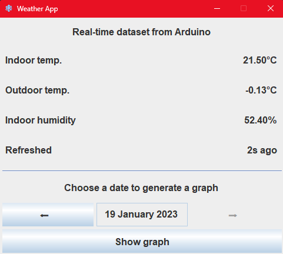
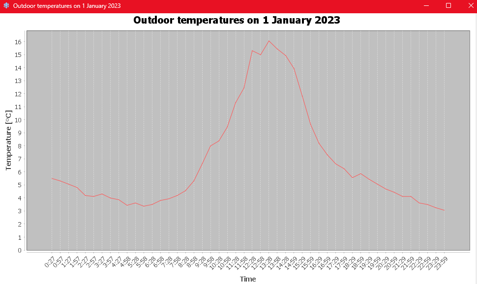

# Weather app
Weather app written in Java (Swing, JDBC) for OOP course project at AGH UST, ICT - 3rd semester.

**Author**: [Filip Korus](https://fkor.us/) <[fkorus@student.agh.edu.pl](mailto:fkorus@student.agh.edu.pl)>

## Description
Real-time data is being downloaded from [my server](https://weather.fkor.us/api.php).
Measurements are made on my Arduino weather station and sent to server every (about) 5 seconds.
Every hour temperature is being stored in the MySQL database. Graph from selected day is being generated from data read from DB.

### Preview

