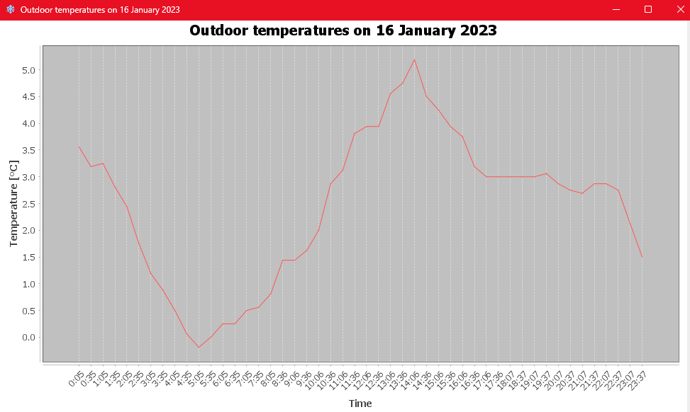

# Weather app
Weather app written in Java (Swing, JDBC) for OOP course at AGH UST, ICT - 3rd semester.

**Author**: [Filip Korus](https://fkor.us/) <[fkorus@student.agh.edu.pl](mailto:fkorus@student.agh.edu.pl)>

### Preview

